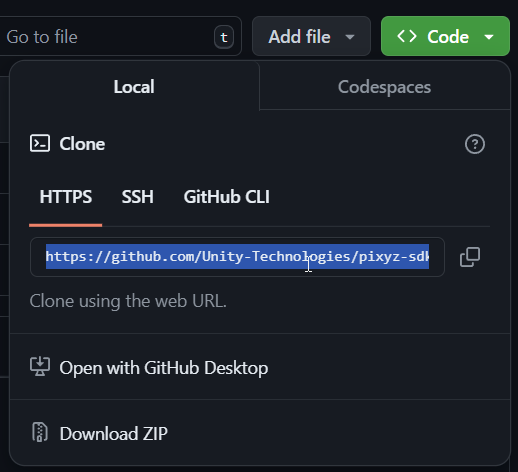
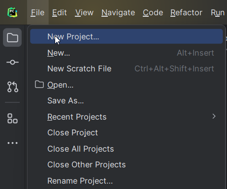
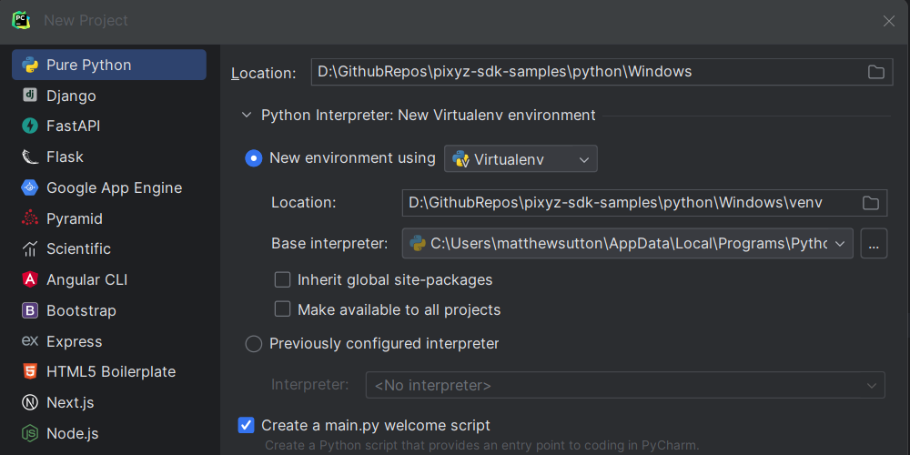
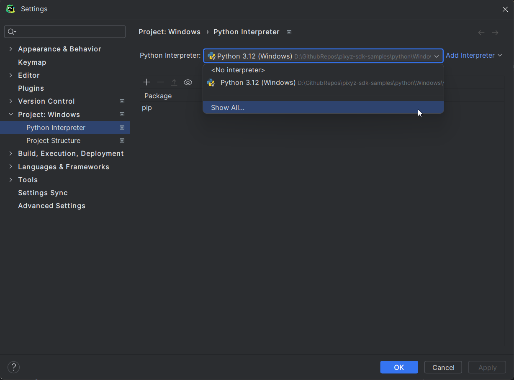
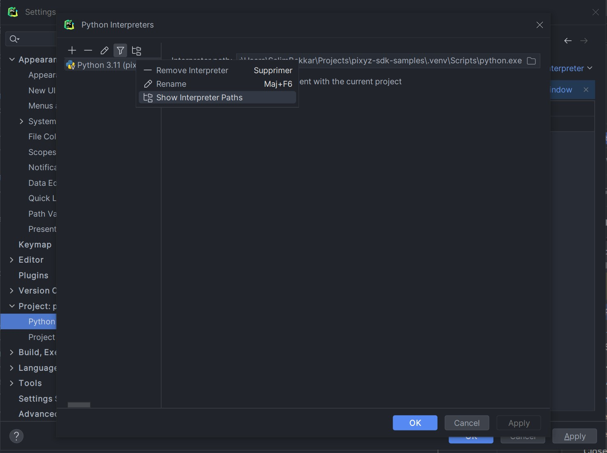
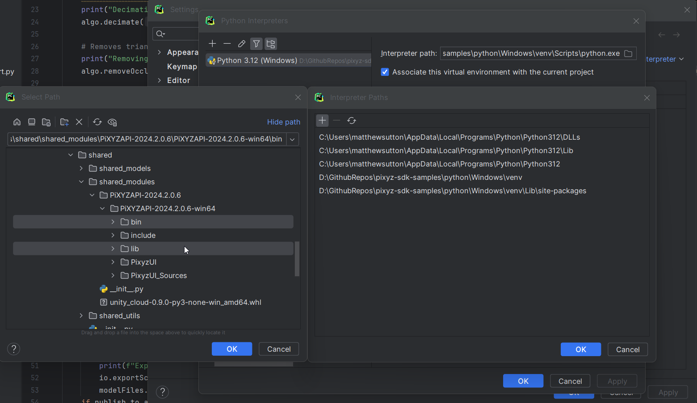
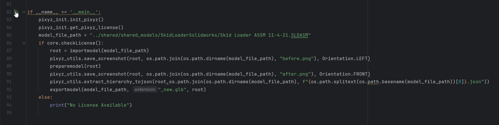
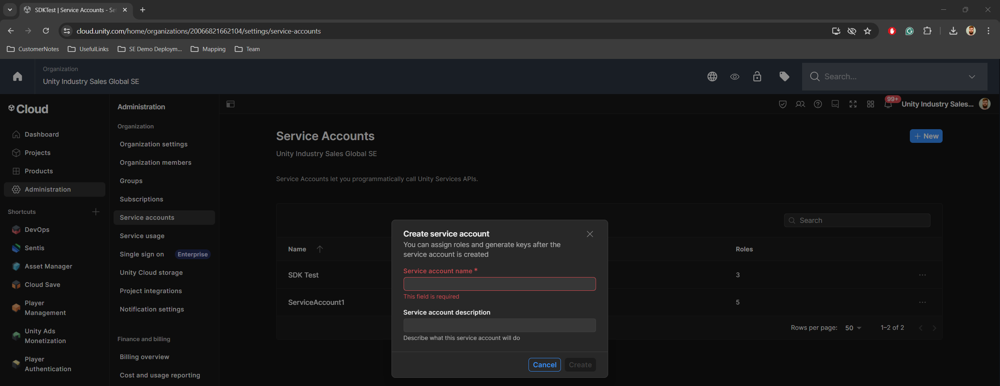

# Pixyz Engine SDK Samples

This GitHub repo contains a set of Pixyz Engine SDK samples to help users get started with the Pixyz SDK.

## Documentation
**Unity Cloud SDK** 
https://docs.unity.com/cloud/en-us/asset-manager/python-sdk

**pixyz SDK**
https://www.pixyz-software.com/documentations/html/2024.3/sdk/manual/index.html

## Samples

- Import Optimize Export: This simple sample forms the basis of all the other samples. It demonstrates how to simply initialize pixyz SDK, import a model, tesselate it, and export the model. In addition, it demonstrates how you can use pixyz SDK to capture screenshots and extract metadata from your model hierarchy.
- Folder Watcher: This sample watches a folder for new models to be pasted into it and then imports and processes them using the functions defined in the previous sample. The sample also demonstrates how to import settings via a config.json file and upload exported files to Unity Cloud Asset Manager. This sample is based on the old pixyz Scenario Processor sample and is a great way to see the differences between SDK and the legacy Scenario Processor.
- Parallel Processing: This sample shows how pixyz SDK can be used across multiple processes, demonstrating how you can start a process, terminate a process and monitor processes in parallel from a simple py QT UI. This sample requires multiple pixyz SDK licenses but demonstrates the power of parallel processing and operating using individual processes rather than a single process that runs for a long time.

## Git LFS Setup

This repository uses Git LFS (Large File Storage) to manage large files. To ensure you have Git LFS installed and set up correctly, follow these steps:

**Install Git LFS:** Download and install Git LFS from [here](https://git-lfs.github.com/)

## Installation Instructions

1. Clone the GitHub Repo using your tool of choice. The example below uses GitHub Desktop by copying and pasting the GitHub repo URL

   
   

2. Create a python project using your script editor of choice. This example is using PyCharm and you simply point to the python/Windows folder
   
   
   

3. Add pixyz SDK bin and lib folder to the projects interpreter path. To do this in pycharm go to Settings>Python Interpreter>Show All>Show Interpreter Paths>Add(+)
Then Select the bin and lib folder located at [Project directory]/shared/shared_modules/PiXYZAPI-XXXX.X.X.X/

4. To install the local Unity Cloud SDK package for the folder watcher sample run "pip install shared/shared_modules/unity_cloud-0.9.0-py3-none-win_amd64.whl" in the local terminal
5. To install the python QT package for the parallel processing sample run "pip install pyside6" in the local terminal

**The Project is now installed and setup. To use the samples please follow the usage instructions below**

## Usage Instructions

Note: All the samples use the common functions defined in the ImportOptimiseExport script. You will need to follow these first initial steps for other samples to work.

**Import Optimise Export**

1. First we need to setup our Pixyz SDK license - Open the script shared/shared_utils/pixyz_utils/pixyz_init.py 
2. Replace "VALIDATION_KEY" with the Validation key you would have recieved
3. Replace "SERVER_HOSTNAME" with the name of your license server, you can also set a IP address instead
4. Change your port number to that of your license server
5. Open the script ImportOptimiseExport/import_optimise_export.py
6. This script contains the main functions that are used by the other samples. At the bottom of the script you will see a section like below

7. To run the script just press the play button indicated in the image.
   This will:
   1. Initialise pixyz
   2. Get a pixyz license from the server
   3. Import the SkidLoader model located in the shared models folder contained in this repository
   4. Generate a screen shot before tesselation, saving it to the skidloaders folder
   5. Tessellate the model using the prepare function defined in this script
   6. Save a screen shot after tesselation
   7. Extract the models objects names, transforms and metadata to a json file in the models folder
   8. Export the tessellated model as a glb file. You can change the extension by simply changing the extension argument given in the exportmodel function call

**Folder Watcher**

Note: This sample can use the Unity cloud SDK to upload files straight to Asset Manager, to use this function make sure to install the Unity Cloud SDK using step 7 in the installation steps.

1. Open the config.json file under FolderWatcher/config.json
2. Enter your location of your input and output folder. In this sample they are two local folders under this sample directory
3. Enter any file extensions you want to generate for each processed file that you import. These are exported into the output folder
4. Optimization runs an additional function after tesselation that decimates and removes hidden components
5. If you aren't going to upload to Unity Cloud set "publish_to_assetmanager" to "False" and you can skip to step 14
6. Make sure "publish_to_assetmanager" is set True
7. Replace "ORG_ID" with the Organization Id of your Organization where you want your files to go to, this can be found in the browser bar after organizations/XXXXXXXXXXXX
8. Replace "PROJ_ID" with the Project Id of your Project where you want your files to go to, this can be found in the browser bar after projects/XXXXXXXXXXXX. If you dont have a project setup then create one by going to cloud.unity.com>your organization>Asset Manager>Manage Projects> Create Project
9. Replace "COLLECTION_PATH" with the collection that you want created/updated in your project. Leave it blank if you dont want a collection to be used
10. Replace/Append "TAG" with a comma seperated list of Tags that you want added to your asset when the asset is created on asset manager
11. To upload to Unity Cloud Asset Manager without logging in manually we need to use a service account. Go to cloud.unity.com your organization>Administration>Service Accounts

12. Firstly add a key, you will need to copy paste the key details into the script shared/shared_utils/unity_cloud_utils/unitycloud_init.py into their respective fields
13. Then assign the Asset Manager Admin Organization role under Manage Organization Roles. Under Project Roles Assign Asset Manager Contributor and Unity Environments Admin. These need to be linked to the specific project that you created/used in step 8
14. Open FolderWatcher/watcher.py At the bottom you will see a play button, press this to execute the main function. Parsing the config.json file that we already updated.
15. You will see in the console that it will print out the values of the config file and display that it is waiting for files
16. Copy paste a single file into the folder watcher input folder directory
17. Exported files will appear in the output folder and if you have used Unity Cloud AssetManager they will also appear in your project on asset manager

**Parallel Processing**

Note: This sample consumes multiple pixyz licenses at the same time as they are initialized in separate processes that run in parallel
1. Make sure that you have pyside6 installed as per step 8 in the installation doc. This is what is used to create the user interface
2. Locate the folder ParallelProcessing. You will see two scripts, one is the main script that controls the UI and exectues the second script per process that is started.
3. Run the main script, you will see a new window appear, you can use this window to add new files to import by using the + button at the bottom.
4. Each file that you import will start a new process and consume a node of pixyz SDK.
5. These will run in parallel until completed or terminated.  
6. All processes that are running or completed will be present in the main UI process.
7. Any information that is printed to the console from the sub process will be shown in the label field of that process in the UI
